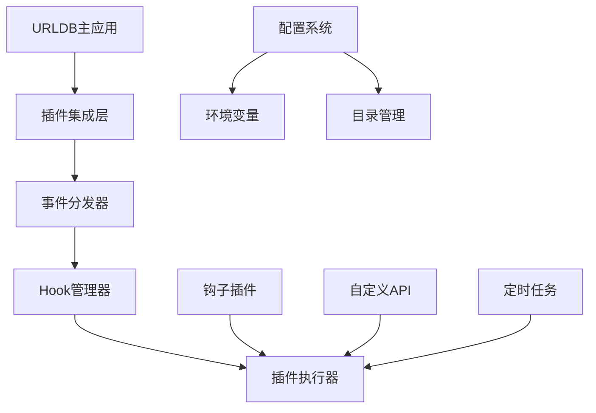

# URLDB 插件系统文档

## 📚 文档目录

本文档集合包含URLDB插件系统的完整技术文档，帮助开发者理解、使用和开发插件。

### 🎯 核心文档

| 文档名称 | 描述 | 适用对象 |
|---------|------|---------|
| [📋 开发指南](./插件系统开发指南.md) | 插件开发的完整教程和最佳实践 | 开发者 |
| [🚀 快速入门](./插件系统快速入门.md) | 插件系统快速上手指南 | 新手开发者 |
| [🏗️ 架构概述](./插件系统架构概述.md) | 插件系统架构和设计理念 | 架构师、开发者 |

---

## 🚀 快速开始

### 1. 环境准备

```bash
# 克隆项目
git clone https://github.com/ctwj/urldb.git
cd urldb

# 安装依赖
go mod tidy

# 配置环境变量
cp .env.example .env
# 编辑 .env 文件，设置数据库连接等信息
```

### 2. 启动插件系统

```bash
# 启用插件系统（在 .env 文件中）
PLUGIN_ENABLED=true
PLUGIN_HOT_RELOAD=true

# 编译并启动
go build -o urldb .
./urldb
```

### 3. 创建第一个插件

插件文件需要放置在 `plugin-system/hooks/` 目录下，文件名以 `.plugin.js` 结尾：

```javascript
// plugin-system/hooks/hello_world.plugin.js
/// <reference path="../pb_data/types.d.ts" />

/**
 * hello_world 钩子
 * 创建时间: 2026-01-05 10:00:00
 *
 * @name hello_world
 * @display_name Hello World插件
 * @author 开发者姓名
 * @description 我的第一个URLDB插件
 * @version 1.0.0
 */

// 监听URL添加事件
onURLAdd(function(event) {
    console.log("检测到新URL:", event.url.title);
    log("info", "Hello World插件处理了新的URL: " + event.url.title, "hello_world");
});

// 添加自定义API路由
routerAdd("GET", "/api/hello", (e) => {
    return e.json(200, {
        message: "Hello from my first plugin!",
        timestamp: new Date().toISOString()
    });
});
```

---

## 🏗️ 系统架构概览



### 核心特性

- ✅ **事件驱动架构** - 基于Hook机制的异步事件处理
- ✅ **类型安全** - 完整的Go类型系统和泛型支持
- ✅ **热重载支持** - 开发模式下实时插件更新
- ✅ **安全隔离** - 插件运行在独立的沙箱环境中
- ✅ **性能优化** - VM池管理和缓存机制
- ✅ **目录自动创建** - 系统自动创建必需目录

---

## 📖 文档导览

### 📋 开发指南文档

**主要章节：**
1. [插件系统概述](./插件系统开发指南.md#插件系统概述) - 核心特性和架构
2. [插件类型](./插件系统开发指南.md#插件类型) - 钩子插件等
3. [插件目录结构](./插件系统开发指南.md#插件目录结构) - 文件组织方式
4. [插件开发基础](./插件系统开发指南.md#插件开发基础) - 基本语法和结构
5. [系统事件与钩子](./插件系统开发指南.md#系统事件与钩子) - 事件监听和处理
6. [可用的API与绑定](./插件系统开发指南.md#可用的api与绑定) - 系统功能接口
7. [插件配置](./插件系统开发指南.md#插件配置) - 配置声明和管理
8. [路由与接口开发](./插件系统开发指南.md#路由与接口开发) - 自定义API开发
9. [定时任务](./插件系统开发指南.md#定时任务) - Cron任务管理
10. [文件操作](./插件系统开发指南.md#文件操作) - 文件读写操作
11. [数据库操作](./插件系统开发指南.md#数据库操作) - 数据库查询和修改
12. [安全与验证](./插件系统开发指南.md#安全与验证) - 安全函数和验证
13. [错误处理与日志](./插件系统开发指南.md#错误处理与日志) - 错误处理机制
14. [部署与管理](./插件系统开发指南.md#部署与管理) - 部署和管理指南

**适用场景：**
- 📝 插件开发学习
- 🏗️ 项目架构设计
- 🔧 代码质量提升
- 🚀 性能优化实施

### 🚀 快速入门文档

**主要章节：**
1. [简介](./插件系统快速入门.md#简介) - 插件系统基本概念
2. [创建第一个插件](./插件系统快速入门.md#创建第一个插件) - 快速上手示例
3. [核心功能概览](./插件系统快速入门.md#核心功能概览) - 主要API介绍
4. [部署插件](./插件系统快速入门.md#部署插件) - 部署流程
5. [调试技巧](./插件系统快速入门.md#调试技巧) - 调试方法
6. [常见问题](./插件系统快速入门.md#常见问题) - 常见问题解决
7. [安全提示](./插件系统快速入门.md#安全提示) - 安全开发建议

**适用场景：**
- 🚀 快速上手和部署
- 🛠️ 日常运维和配置
- 🐛 问题排查和调试

### 🏗️ 架构概述文档

**主要章节：**
1. [概述](./插件系统架构概述.md#概述) - 插件系统整体介绍
2. [核心设计理念](./插件系统架构概述.md#核心设计理念) - 设计原则和目标
3. [架构组件](./插件系统架构概述.md#架构组件) - 各组件功能说明
4. [插件类型](./插件系统架构概述.md#插件类型) - 支持的插件类型
5. [插件生命周期](./插件系统架构概述.md#插件生命周期) - 插件从加载到执行的流程
6. [API接口概览](./插件系统架构概述.md#api接口概览) - 可用的API接口
7. [安全机制](./插件系统架构概述.md#安全机制) - 安全设计和实现
8. [最佳实践](./插件系统架构概述.md#最佳实践) - 开发建议
9. [部署注意事项](./插件系统架构概述.md#部署注意事项) - 部署相关信息

**适用场景：**
- 🏛️ 系统架构设计
- 🔍 深入理解系统
- 🔒 安全方案制定

---

## 🎯 快速参考

### 环境变量配置

```bash
# 插件系统开关
PLUGIN_ENABLED=true

# 热重载
PLUGIN_HOT_RELOAD=true

# 目录配置
PLUGIN_HOOKS_DIR=./plugin-system/hooks
PLUGIN_MIGRATIONS_DIR=./migrations
PLUGIN_TYPES_DIR=./plugin-system/types

# 性能配置
PLUGIN_VM_POOL_SIZE=10
PLUGIN_DEBUG=false
```

### 插件结构示例

#### 钩子插件
```javascript
/// <reference path="../pb_data/types.d.ts" />

/**
 * my_plugin 钩子
 * 创建时间: 2026-01-05 10:00:00
 *
 * @name my_plugin
 * @display_name 我的插件
 * @author 开发者姓名
 * @description 插件功能描述
 * @version 1.0.0
 *
 * @config
 * @field {string} webhook_url Webhook URL "Webhook通知地址" @default "https://example.com/webhook"
 * @field {boolean} enable_notification 启用通知 "是否启用通知功能" @default true
 * @config
 */

// 监听系统事件
onURLAdd(function(event) {
    console.log("URL添加:", event.url.title);
    // 处理逻辑
});

// 添加自定义路由
routerAdd("GET", "/api/my-endpoint", (e) => {
    return e.json(200, {
        message: "Hello from plugin"
    });
});

// 添加定时任务
cronAdd("my_task", "0 * * * *", () => {
    log("info", "定时任务执行", "my_plugin");
});
```

---

## 🔗 相关资源

### 技术栈

- **Go 1.24+** - 主要开发语言
- **JavaScript/TypeScript** - 插件开发语言
- **PostgreSQL** - 主数据库
- **Gin** - Web框架
- **goja** - JavaScript运行时

### 开发工具推荐

- **VS Code** - 推荐IDE
- **Postman** - API测试工具
- **DBeaver** - 数据库管理工具
- **Git** - 版本控制

---

## 🤝 贡献指南

### 贡献方式

1. **提交Issue** - 报告问题或提出建议
2. **提交PR** - 贡献代码或文档
3. **开发插件** - 创建和分享插件
4. **完善文档** - 改进文档质量

### 开发流程

1. Fork项目到个人仓库
2. 创建功能分支 (`git checkout -b feature/amazing-feature`)
3. 提交更改 (`git commit -m 'Add amazing feature'`)
4. 推送分支 (`git push origin feature/amazing-feature`)
5. 创建Pull Request

### 代码规范

- 遵循Go语言官方编码规范
- 使用有意义的变量和函数名
- 添加必要的注释和文档
- 编写单元测试覆盖核心功能

---

## 📄 许可证

本项目采用 MIT 许可证 - 查看 [LICENSE](../LICENSE) 文件了解详情。


---

## 📞 联系方式

- **项目主页**: https://github.com/ctwj/urldb
- **文档仓库**: https://github.com/ctwj/urldb/docs
- **问题反馈**: https://github.com/ctwj/urldb/issues

---

*最后更新: 2026年1月5日*