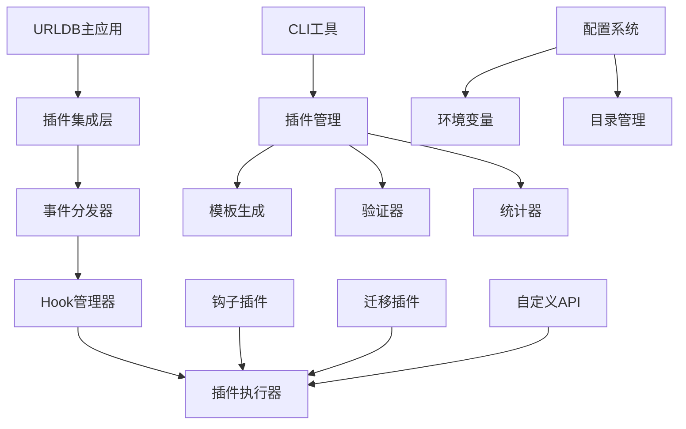

# URLDB 插件系统文档

## 📚 文档目录

本文档集合包含URLDB插件系统的完整技术文档，帮助开发者理解、使用和开发插件。

### 🎯 核心文档

| 文档名称 | 描述 | 适用对象 |
|---------|------|---------|
| [📋 技术方案](./插件系统技术方案.md) | 插件系统的完整技术架构和设计 | 架构师、技术决策者 |
| [📖 使用方案](./插件系统使用方案.md) | 插件系统的使用指南和配置说明 | 用户、运维人员 |
| [👨‍💻 开发指南](./插件开发指南.md) | 插件开发的完整教程和最佳实践 | 开发者 |

---

## 🚀 快速开始

### 1. 环境准备

```bash
# 克隆项目
git clone https://github.com/ctwj/urldb.git
cd urldb

# 安装依赖
go mod tidy

# 配置环境变量
cp .env.example .env
# 编辑 .env 文件，设置数据库连接等信息
```

### 2. 启动插件系统

```bash
# 启用插件系统（在 .env 文件中）
PLUGIN_ENABLED=true
PLUGIN_HOT_RELOAD=true

# 编译并启动
go build -o urldb .
./urldb
```

### 3. 创建第一个插件

```bash
# 创建钩子插件
./urldb plugin create my_first_hook hook

# 创建数据库迁移
./urldb plugin create add_custom_table migration

# 查看插件状态
./urldb plugin stats
```

---

## 🏗️ 系统架构概览



### 核心特性

- ✅ **事件驱动架构** - 基于Hook机制的异步事件处理
- ✅ **类型安全** - 完整的Go类型系统和泛型支持
- ✅ **热重载支持** - 开发模式下实时插件更新
- ✅ **CLI工具链** - 完整的插件管理命令行工具
- ✅ **安全隔离** - 插件运行在独立的沙箱环境中
- ✅ **性能优化** - VM池管理和缓存机制

---

## 📖 文档导览

### 📋 技术方案文档

**主要章节：**
1. [系统概述](./插件系统技术方案.md#系统概述) - 设计目标和核心特性
2. [技术架构](./插件系统技术方案.md#技术架构) - 整体架构和层次设计
3. [核心组件](./插件系统技术方案.md#核心组件) - Hook系统、事件系统、JavaScript运行时
4. [事件系统](./插件系统技术方案.md#事件系统) - 事件类型和生命周期
5. [配置管理](./插件系统技术方案.md#配置管理) - 环境变量和配置验证
6. [安全机制](./插件系统技术方案.md#安全机制) - 代码隔离和权限控制
7. [性能优化](./插件系统技术方案.md#性能优化) - VM池管理和缓存机制
8. [扩展接口](./插件系统技术方案.md#扩展接口) - 自定义事件和插件通信

**适用场景：**
- 🏛️ 系统架构设计
- 🔧 技术选型决策
- 📊 性能评估和优化
- 🔒 安全方案制定

### 📖 使用方案文档

**主要章节：**
1. [快速开始](./插件系统使用方案.md#快速开始) - 环境要求和基础配置
2. [CLI工具使用](./插件系统使用方案.md#cli工具使用) - 命令行工具详细说明
3. [插件配置](./插件系统使用方案.md#插件配置) - 全局配置和动态配置
4. [事件监听](./插件系统使用方案.md#事件监听) - 内置事件类型和自定义事件
5. [数据库操作](./插件系统使用方案.md#数据库操作) - 基本查询、事务处理、复杂查询
6. [API扩展](./插件系统使用方案.md#api扩展) - 自定义路由和中间件
7. [调试和监控](./插件系统使用方案.md#调试和监控) - 调试模式、健康检查、错误处理
8. [常见问题](./插件系统使用方案.md#常见问题) - 问题排查和解决方案

**适用场景：**
- 🚀 快速上手和部署
- 🛠️ 日常运维和配置
- 🐛 问题排查和调试
- 📊 系统监控和维护

### 👨‍💻 开发指南文档

**主要章节：**
1. [开发环境搭建](./插件开发指南.md#开发环境搭建) - 工具安装和项目配置
2. [插件基础结构](./插件开发指南.md#插件基础结构) - 钩子插件和迁移插件结构
3. [JavaScript/TypeScript开发](./插件开发指南.md#javascripttypescript开发) - 类型定义和高级模式
4. [数据库操作](./插件开发指南.md#数据库操作) - 最佳实践和优化技巧
5. [API开发](./插件开发指南.md#api开发) - RESTful API设计和错误处理
6. [测试和调试](./插件开发指南.md#测试和调试) - 单元测试框架和调试工具
7. [部署和发布](./插件开发指南.md#部署和发布) - 插件打包和版本管理
8. [最佳实践](./插件开发指南.md#最佳实践) - 代码规范、性能优化、安全指南

**适用场景：**
- 📝 插件开发学习
- 🏗️ 项目架构设计
- 🔧 代码质量提升
- 🚀 性能优化实施

---

## 🎯 快速参考

### 常用命令

```bash
# 查看所有插件命令
./urldb plugin --help

# 创建插件
./urldb plugin create <name> <type>

# 列出插件
./urldb plugin list

# 验证插件
./urldb plugin validate <file_path>

# 查看统计
./urldb plugin stats
```

### 环境变量配置

```bash
# 插件系统开关
PLUGIN_ENABLED=true

# 热重载
PLUGIN_HOT_RELOAD=true

# 目录配置
PLUGIN_HOOKS_DIR=./hooks
PLUGIN_MIGRATIONS_DIR=./migrations
PLUGIN_TYPES_DIR=./pb_data

# 性能配置
PLUGIN_VM_POOL_SIZE=10
PLUGIN_DEBUG=false
```

### 插件结构示例

#### 钩子插件
```javascript
/// <reference path="../pb_data/types.d.ts" />

/**
 * 插件示例
 */

onURLAdd((e) => {
    console.log("URL添加:", e.url.url);

    // 自定义处理逻辑
    e.url.category = "auto-categorized";

    return e.next();
});
```

#### 迁移插件
```javascript
/**
 * 数据库迁移示例
 */

migrate(
    // up 迁移
    (app) => {
        app.db.run(`
            CREATE TABLE IF NOT EXISTS example_table (
                id TEXT PRIMARY KEY,
                data JSON,
                created_at DATETIME DEFAULT CURRENT_TIMESTAMP
            )
        `);
    },

    // down 回滚
    (app) => {
        app.db.run("DROP TABLE IF EXISTS example_table");
    }
);
```

---

## 🔗 相关资源

### 技术栈

- **Go 1.24+** - 主要开发语言
- **JavaScript/TypeScript** - 插件开发语言
- **PostgreSQL** - 主数据库
- **Cobra** - CLI框架
- **Gin** - Web框架

### 参考项目

- [PocketBase](https://pocketbase.io/) - 插件系统设计灵感来源
- [goja](https://github.com/dop251/goja) - JavaScript运行时
- [Cobra](https://github.com/spf13/cobra) - CLI命令框架

### 开发工具推荐

- **VS Code** - 推荐IDE
- **Postman** - API测试工具
- **DBeaver** - 数据库管理工具
- **Git** - 版本控制

---

## 🤝 贡献指南

### 贡献方式

1. **提交Issue** - 报告问题或提出建议
2. **提交PR** - 贡献代码或文档
3. **开发插件** - 创建和分享插件
4. **完善文档** - 改进文档质量

### 开发流程

1. Fork项目到个人仓库
2. 创建功能分支 (`git checkout -b feature/amazing-feature`)
3. 提交更改 (`git commit -m 'Add amazing feature'`)
4. 推送分支 (`git push origin feature/amazing-feature`)
5. 创建Pull Request

### 代码规范

- 遵循Go语言官方编码规范
- 使用有意义的变量和函数名
- 添加必要的注释和文档
- 编写单元测试覆盖核心功能

---

## 📄 许可证

本项目采用 MIT 许可证 - 查看 [LICENSE](../LICENSE) 文件了解详情。

---

## 📞 联系方式

- **项目主页**: https://github.com/ctwj/urldb
- **文档仓库**: https://github.com/ctwj/urldb/docs
- **问题反馈**: https://github.com/ctwj/urldb/issues

---

*最后更新: 2024年12月24日*