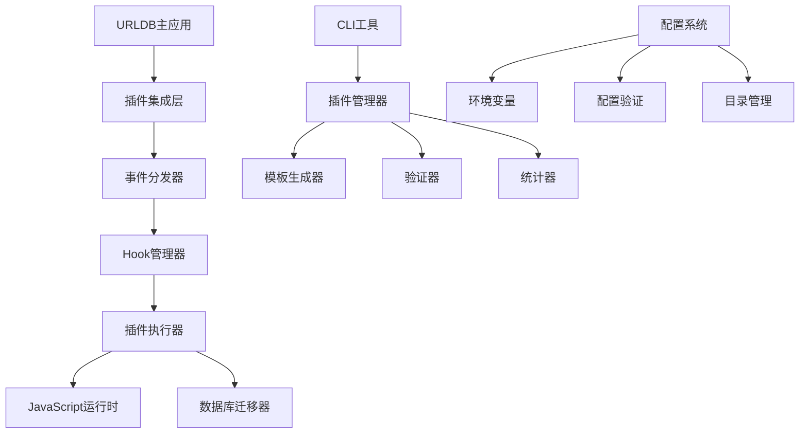

# URLDB 插件系统技术方案

## 📋 目录

1. [系统概述](#系统概述)
2. [技术架构](#技术架构)
3. [核心组件](#核心组件)
4. [事件系统](#事件系统)
5. [配置管理](#配置管理)
6. [安全机制](#安全机制)
7. [性能优化](#性能优化)
8. [扩展接口](#扩展接口)

---

## 🎯 系统概述

### 设计目标
URLDB插件系统是一个基于事件驱动架构的扩展系统，借鉴了PocketBase的设计理念，旨在为URLDB应用提供灵活、安全、高性能的插件化能力。

### 核心特性
- ✅ **事件驱动架构** - 基于Hook机制的异步事件处理
- ✅ **类型安全** - 完整的Go类型系统和泛型支持
- ✅ **优先级控制** - 插件执行顺序可配置
- ✅ **热重载支持** - 开发模式下实时插件更新
- ✅ **CLI工具链** - 完整的插件管理命令行工具
- ✅ **错误隔离** - 单个插件错误不影响主系统
- ✅ **资源管理** - 自动资源清理和生命周期管理

---

## 🏗️ 技术架构

### 整体架构图



### 核心层次

1. **应用层 (Application Layer)**
   - URLDB主业务逻辑
   - HTTP路由和API处理
   - 数据库操作

2. **插件集成层 (Plugin Integration Layer)**
   - 事件触发和分发
   - 插件生命周期管理
   - 错误处理和日志

3. **插件执行层 (Plugin Execution Layer)**
   - Hook处理器
   - JavaScript运行时
   - 数据库迁移引擎

4. **工具支持层 (Tooling Layer)**
   - CLI管理工具
   - 模板生成器
   - 配置管理系统

---

## 🔧 核心组件

### 1. Hook系统

#### 核心接口
```go
// Hook 通用接口
type Hook[T any] interface {
    Bind(handler *Handler[T]) string
    BindFunc(fn func(e T) error) string
    Unbind(id string) error
    Trigger(e T) error
}

// 事件处理器
type Handler[T any] struct {
    ID     string
    Func   func(e T) error
    Priority int
}

// 事件数据接口
type Resolver interface {
    Next() error
}
```

#### 实现特性
- **泛型支持** - 类型安全的事件处理
- **优先级排序** - 高优先级处理器优先执行
- **错误链传播** - 支持责任链模式
- **并发安全** - 线程安全的Hook操作

### 2. 事件系统

#### 内置事件类型

```go
// URL相关事件
type URLEvent struct {
    *entity.Resource
    data map[string]interface{}
    resolver.Resolver
}

// 用户相关事件
type UserEvent struct {
    *entity.User
    data map[string]interface{}
    resolver.Resolver
}

// API请求事件
type APIRequestEvent struct {
    Method  string
    Path    string
    Headers map[string]string
    Body    interface{}
    resolver.Resolver
}
```

#### 事件生命周期
1. **事件创建** - 构建事件数据结构
2. **预处理** - 数据验证和转换
3. **Hook触发** - 按优先级执行处理器
4. **后处理** - 清理和日志记录
5. **结果返回** - 处理结果聚合

### 3. JavaScript运行时

#### 运行时架构
```go
type JSVM struct {
    vmPool    chan *goja.Runtime
    hooksDir  string
    migrationsDir string
    typesDir  string
    hotReload bool
    debug     bool
}
```

#### 核心功能
- **VM池管理** - 复用JavaScript运行时实例
- **热重载** - 文件变化时自动重新加载
- **类型绑定** - Go对象到JavaScript的类型映射
- **安全沙箱** - 限制JavaScript代码访问权限

---

## 📡 事件系统详解

### 事件注册机制

```go
// 注册URL添加事件钩子
app.OnURLAdd().BindFunc(func(e *URLEvent) error {
    // 自定义处理逻辑
    if strings.Contains(e.URL, "example.com") {
        e.Category = "example"
    }
    return e.Next()
})
```

### 内置钩子列表

| 钩子名称 | 触发时机 | 事件类型 | 用途 |
|---------|---------|---------|------|
| `OnURLAdd` | URL添加时 | `*URLEvent` | URL处理、分类、验证 |
| `OnURLAccess` | URL访问时 | `*URLAccessEvent` | 访问统计、权限检查 |
| `OnUserLogin` | 用户登录时 | `*UserEvent` | 登录验证、日志记录 |
| `OnUserRegister` | 用户注册时 | `*UserEvent` | 注册验证、欢迎消息 |
| `OnAPIRequest` | API请求时 | `*APIRequestEvent` | 请求拦截、限流控制 |
| `OnDatabaseMigration` | 数据库迁移时 | `*MigrationEvent` | 数据转换、验证 |

### 事件数据传递

```go
// 事件数据结构
type URLEvent struct {
    *entity.Resource           // 原始URL数据
    data        map[string]interface{} // 扩展数据
    resolver.Resolver         // 下一步处理器
}

// 扩展数据访问
func (e *URLEvent) SetData(key string, value interface{}) {
    if e.data == nil {
        e.data = make(map[string]interface{})
    }
    e.data[key] = value
}

func (e *URLEvent) GetData(key string) interface{} {
    return e.data[key]
}
```

---

## ⚙️ 配置管理

### 配置结构

```go
type PluginConfig struct {
    Enabled      bool   `json:"enabled" env:"PLUGIN_ENABLED"`
    HotReload    bool   `json:"hot_reload" env:"PLUGIN_HOT_RELOAD"`
    HooksDir     string `json:"hooks_dir" env:"PLUGIN_HOOKS_DIR"`
    MigrationsDir string `json:"migrations_dir" env:"PLUGIN_MIGRATIONS_DIR"`
    TypesDir     string `json:"types_dir" env:"PLUGIN_TYPES_DIR"`
    VMPoolSize   int    `json:"vm_pool_size" env:"PLUGIN_VM_POOL_SIZE"`
    Debug        bool   `json:"debug" env:"PLUGIN_DEBUG"`
}
```

### 环境变量配置

```bash
# .env 文件配置
PLUGIN_ENABLED=true
PLUGIN_HOT_RELOAD=true
PLUGIN_HOOKS_DIR=./hooks
PLUGIN_MIGRATIONS_DIR=./migrations
PLUGIN_TYPES_DIR=./pb_data
PLUGIN_VM_POOL_SIZE=10
PLUGIN_DEBUG=false
```

### 配置验证

```go
func ValidatePluginConfig(config *PluginConfig) error {
    if config.HooksDir == "" {
        return fmt.Errorf("Hooks directory cannot be empty")
    }
    if config.VMPoolSize <= 0 || config.VMPoolSize > 100 {
        return fmt.Errorf("VM pool size must be between 1 and 100")
    }
    return nil
}
```

---

## 🔒 安全机制

### 1. 代码隔离

- **进程隔离** - 插件运行在独立的JavaScript VM中
- **内存限制** - 限制插件可使用的内存大小
- **执行超时** - 防止无限循环和长时间执行
- **API限制** - 限制插件可访问的系统API

### 2. 权限控制

```go
// JavaScript API权限白名单
var allowedAPIs = map[string]bool{
    "console.log":     true,
    "console.error":   true,
    "console.warn":    true,
    "db.query":        true,
    "db.execute":      true,
    "http.get":        false,  // 禁止网络请求
    "fs.read":         false,  // 禁止文件系统访问
}
```

### 3. 输入验证

- **参数类型检查** - 严格的类型验证
- **SQL注入防护** - 参数化查询
- **XSS防护** - 输出内容转义
- **文件类型验证** - 上传文件类型限制

---

## ⚡ 性能优化

### 1. VM池管理

```go
// VM池实现
type VMPool struct {
    pool chan *goja.Runtime
    maxSize int
    currentSize int
}

func (p *VMPool) Get() *goja.Runtime {
    select {
    case vm := <-p.pool:
        return vm
    default:
        return p.createNewVM()
    }
}

func (p *VMPool) Put(vm *goja.Runtime) {
    select {
    case p.pool <- vm:
    default:
        // 池已满，丢弃VM
    }
}
```

### 2. 缓存机制

- **编译缓存** - JavaScript代码编译结果缓存
- **模板缓存** - 插件模板缓存
- **配置缓存** - 插件配置内存缓存
- **结果缓存** - 插件执行结果缓存

### 3. 异步处理

```go
// 异步事件处理
func (h *Hook[T]) TriggerAsync(e T) {
    go func() {
        defer func() {
            if r := recover(); r != nil {
                log.Printf("Plugin execution panic: %v", r)
            }
        }()
        h.Trigger(e)
    }()
}
```

---

## 🔌 扩展接口

### 1. 自定义事件类型

```go
// 定义自定义事件
type CustomEvent struct {
    Name string
    Data map[string]interface{}
    resolver.Resolver
}

// 注册自定义钩子
app.RegisterHook("custom", func() *Hook[*CustomEvent] {
    return &Hook[*CustomEvent]{}
})

// 触发自定义事件
app.TriggerCustom("custom_event", map[string]interface{}{
    "key": "value",
})
```

### 2. 插件通信接口

```go
// 插件间通信
type PluginBus interface {
    Publish(topic string, data interface{}) error
    Subscribe(topic string, handler func(data interface{})) error
    Unsubscribe(topic string, handlerID string) error
}

// 全局事件总线
var GlobalBus PluginBus = NewEventBus()
```

### 3. 数据库扩展

```go
// 自定义数据库操作
type DatabaseExtension interface {
    Query(sql string, args ...interface{}) (*sql.Rows, error)
    Execute(sql string, args ...interface{}) (sql.Result, error)
    Transaction(fn func(tx *sql.Tx) error) error
}

// 插件中数据库使用
app.OnDatabaseMigration().BindFunc(func(e *MigrationEvent) error {
    db := e.GetDatabase()
    return db.Execute(`
        CREATE TABLE IF NOT EXISTS plugin_data (
            id TEXT PRIMARY KEY,
            data JSON,
            created_at DATETIME DEFAULT CURRENT_TIMESTAMP
        )
    `)
})
```

---

## 📊 监控和调试

### 1. 插件统计

```go
type PluginStats struct {
    TotalHooks       int                    `json:"total_hooks"`
    ActivePlugins    []string               `json:"active_plugins"`
    ExecutionTimes   map[string]time.Duration `json:"execution_times"`
    ErrorCounts      map[string]int          `json:"error_counts"`
    MemoryUsage      int64                  `json:"memory_usage"`
}
```

### 2. 调试工具

```bash
# 查看插件统计
./urldb plugin stats

# 验证插件语法
./urldb plugin validate hooks/my_plugin.pb.js

# 列出所有插件
./urldb plugin list
```

### 3. 日志记录

```go
// 插件执行日志
type PluginLogger struct {
    level LogLevel
    output io.Writer
}

func (l *PluginLogger) LogExecution(pluginID string, duration time.Duration, err error) {
    if err != nil {
        l.Errorf("Plugin %s execution failed: %v (duration: %v)", pluginID, err, duration)
    } else {
        l.Infof("Plugin %s executed successfully (duration: %v)", pluginID, duration)
    }
}
```

---

## 🔄 版本兼容性

### 语义化版本控制
- **主版本号** - 不兼容的API修改
- **次版本号** - 向下兼容的功能性新增
- **修订号** - 向下兼容的问题修正

### API兼容性保证
```go
// 版本化API接口
type PluginAPIv1 interface {
    ProcessURL(url string) error
}

type PluginAPIv2 interface {
    PluginAPIv1
    ProcessURLWithContext(ctx context.Context, url string) error
    ProcessBatch(urls []string) error
}
```

---

## 📚 最佳实践

### 1. 插件开发规范
- 使用TypeScript进行类型安全开发
- 遵循命名约定和代码风格
- 实现适当的错误处理
- 提供完整的文档和示例

### 2. 性能优化建议
- 避免在插件中进行耗时操作
- 合理使用缓存机制
- 及时释放资源
- 监控插件执行性能

### 3. 安全开发指南
- 验证所有输入数据
- 使用最小权限原则
- 避免动态代码执行
- 定期更新依赖包

---

这个技术方案为URLDB插件系统提供了完整的设计和实现指导，确保系统的可扩展性、安全性和高性能。